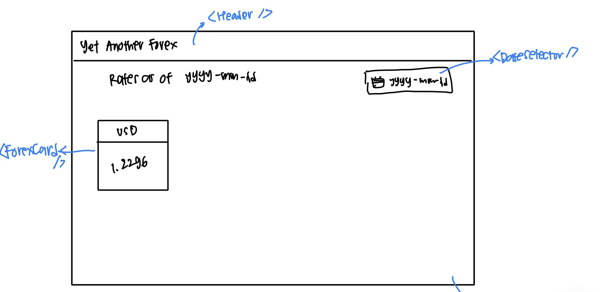
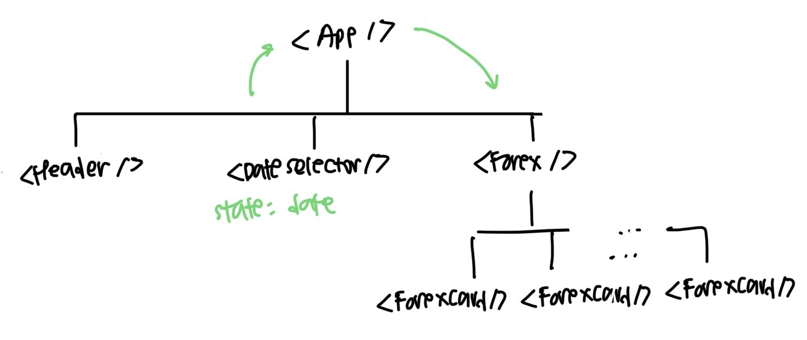

# Forex Tracker

## Description

A simple React web application that displays the latest and historical currency exchange rate using currencylayer API.

### Demo

https://user-images.githubusercontent.com/41258857/188294169-c2246f33-7d55-42ab-9839-851928d6063f.mov

### Tech Stack/Libraries Used

- React
- Bootstrap
- Axios

### Getting Started with Create React App

This project was bootstrapped with [Create React App](https://github.com/facebook/create-react-app).

### Wireframe



From the wireframe above, I created the following component tree:



## Setting up the project

To use the app on your local environment:

1. Clone this repo

```
git clone https://github.com/orlinromy/forex.git
```

2. Move into the `forex` folder

```
cd forex
```

3. Install npm packages

```
npm i
```

4. Run the app

```
npm start
```

## Development Process

1. Draw the wireframe and determine the components
2. Create component tree

   Components:

   - `Header`: Displays Navbar, contains the title of the site

   - `DateSelector`: Displays and keeps track of the date selected by the users

   - `Forex`: Calls the API and feeds the fetched data to `ForexCard` component

   - `ForexCard`: Receives data from `Forex` component

3. Read through currencylayer API and try calling the API using cURL, Postman, and fetch API

4. Implement the components based on the component tree

### Problems faced during the development

When trying to call the API using fetch API, it returns the following:

```
{
    "success":false,
    "error":{
        "code":105,
        "info":"Access Restricted - Your current Subscription Plan does not support HTTPS Encryption."
    }
}
```

After observing the error message, the response URL in the `XMLHttpRequest` object changes from `http://` to `https://`.

One possible solution is to set the proxy in `package.json` to `http://api.currencylayer.com`, so that the browser sends the request as `http://localhost:3000`, and the proxy sends it forward as `http://api.currencylayer.com` (Reference: [LogRocket - Why you should use a proxy server with Create React App](https://blog.logrocket.com/why-you-should-use-proxy-server-create-react-app/))

## Further Development

- Let the user to choose the currency they want to cover

  This can be done by setting a new state to track the currency that the user input and specify the currency when calling the API.
